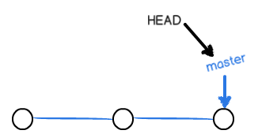
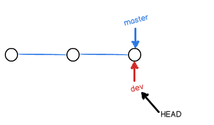

# 分支
## 查看远程库信息
`git remote` / `git remote -v`

## 时间线
* 如果只在主分支`master`上提交时，多次提交会使得`master`分支是一条有着多个节点的线段，而每个节点就是每一次的提交
* `HEAD`指向`msater`分支，`msater`分支指向节点
  
* 如果在`master`新建并切换到分支`dev`，那就是新建一个`dev`分支指向当前节点，将`HEAD`从`master`指向`dev`
  
* 此时`dev`分支继续提交延长线段生成更多节点，`msater`分支不变
* `dev`上工作完成后要和`msater`进行合并，就是将`msater`分支从之前的节点指向`dev`当前的节点，然后将`HEAD`从`dev`指向`master`
* 将`dev`合并到`master`，合并的时候先切换到`master`分支，然后执行`git merge dev`

## 分支操作命令
* 新建`dev`分支: `git branch dev`
* 切换分支: `git switch dev`或者`git checkout dev`
* 新建并切换: `git switch -c dev`或者`git checkout -b dev`
* 查看当前分支: `git branch`
* 合并分支: `git merge dev`
* 删除分支: `git branch -d dev` / (没有合并的时候强制)`git branch -D dev`
* 删除远程分支: `git push --delete origin dev`
* 本地重命名分支: `git branch -m oldName newName`
* 远程分支修改名称: 本地同步远程分支 本地修改分支名 删除远程分支 推送本地改名后的分支到远程
* 推送分支到远程库: `git push -u origin dev` **带上参数`-u` `git status`的时候才能看到有几条`commit`**
* 创建远程库已有的分支到本地: `git checkout -b dev origin/dev`(直接切换分支也会同步)
