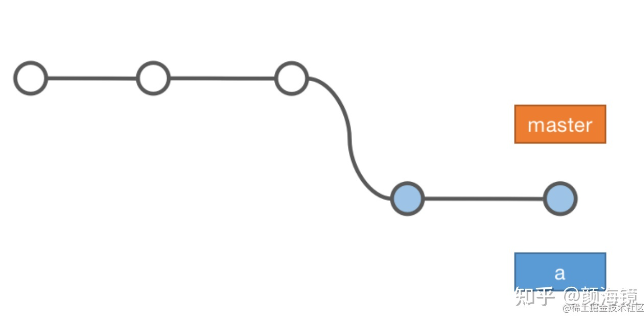
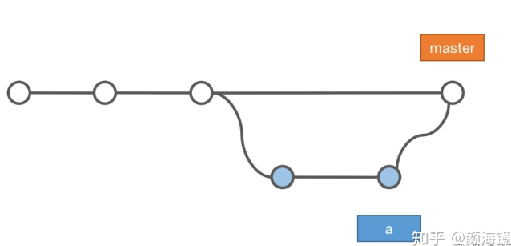
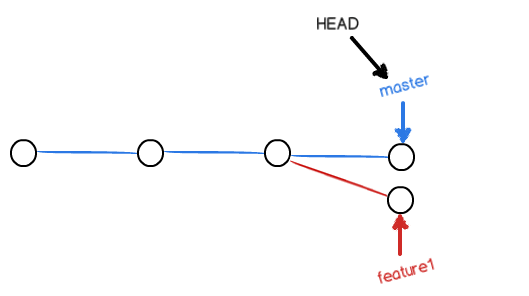
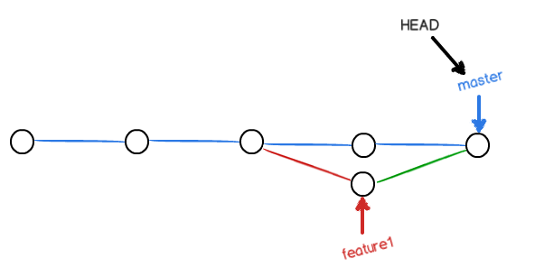
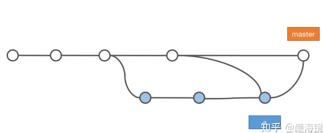
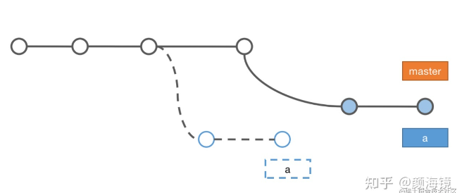
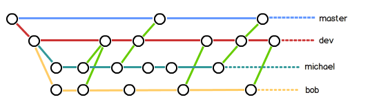

# 合并分支

## 查看日志
`git log` / `git log --graph --pretty=oneline --abbrev-commit`
`git merge --squash`: 不合并多余的`commit`记录所有`commit`合为一个
* `mster`分支一般只有其他分支合并的提交或者发布版本，不会在`master`开发
* 新增一个功能就新建一个分支开发
* 当其他分支的功能开发完成需要合并到主分支的时候有快速合并和非快速合并
   * 快速合并：`master`直接指向新分支的最新节点
   * 非快速合并：`master`新建一个合并节点

## 快速合并(Fast forward)
* 直接将`master`指向`feature/a`最新提交节点`HEAd`指向`master`
* 合并之后删除这个分支，会丢失分支信息，不能在`log`查看分支信息
```
git merge feature/a
```


## 非快速合并（no Fast forward）
* 在`master`新建一个节点进行`feature/a`的合并
* 因为在合并的时候会生成一个新的`commit`，所`git log`能查看分支信息
```
git merge --no-ff feature/a
```


## 合并冲突
* 如果在`master`分支有一个提交
* `feature`也有一个提交，此时两条分支就会多出来两个节点(Y)
  
* 此时两个修改的是同一个文件的同一行，这样执行合并就会产生冲突
* 手动进去文件中解决冲突后再次提交，此时提交的节点就是两个分支交汇（合并）的节点
* 
* 和快速合并不同的是，解决完冲突之后会新生成一个节点，有冲突的时候都是非快速合并


## 合并和变基
* 新建分支a后主分支可能会有新的提交
* 合并分支之前需要先把主分支上别的提交先合并到当前分支a
* 此时使用合并或者变基来进行合并
   * 合并操作简单
   * 变基提交树清晰
 
### 合并（merge）
 ```
git merge master
git checkout master
git merge feature/a
```


### 变基 （rebase）
变基会修改`feature/a`的历史，就像 `feature/a` 是在 `master` 之后开发的一样
```
git rebase master
git checkout master
git merge feature/a
```


## 团队开发
* 不在`master`开发，仅仅只是拿来合并发布版本
* 日常开发在`dev`分支
* 每个人在`dev`分支中新建自己的分支并开发
* 每个人不时的向`dev`分支合并
* 大版本开发完之后将`dev`向`master`合并发布

