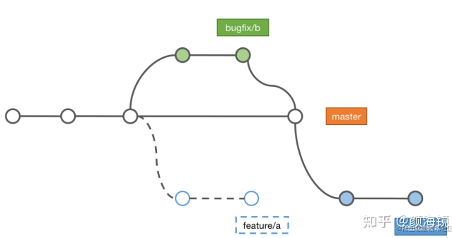

# 故障分支

## 新建`bugfix`分支
* 使用`stash`将当前工作区内容保存
* 切换主分支新建`bugfix`修复分支
* `bug`修复后合并回主分支，并在主分支上发布新的补丁版本
* 此时可以切换回原来的分支继续工作
* 但是由于工作分支是之前在master分支出来的，所以当前的工作分支也存在这个`bug`
* 此时可以使用`cherry-pick`来将刚刚`bugfix`分支的修改内容复制到当前分支
  ```
  #将特定的commit复制过来
  git cherry-pick <[commitid]>
  ```

<!-- * 下游分支需要同步更新
```
git checkout feature/a
git rebase master
```
 -->


